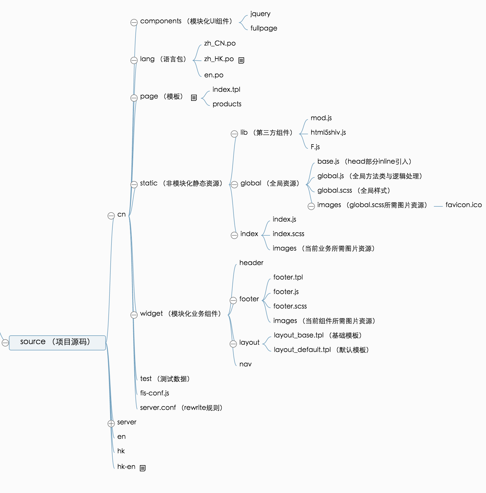

# MZ-FIS Frontend Framework

该框架基于 [FIS3](http://fis.baidu.com/) ，可用于 PHP Smarty 国际化场景

## 目录规范

## 安装方法

`sudo npm install -g mz-fis`

## 补丁细节

### 1、fis3-command-release 

* 支持 weinre 参数调试
* livereload 默认使用局域网 ip 而非 127.0.0.1

### 2、fis-spriter-csssprites

* 支持 与 relative-hook 同时使用 

## 更新日志

### 0.3.6
* 增加 mp4、webm 二进制类型

### 0.3.5 
* mz server clean 命令兼容 fis 3.2.4
* 增加 fis3-server-php 依赖